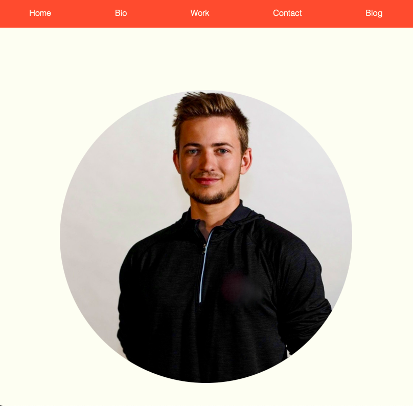
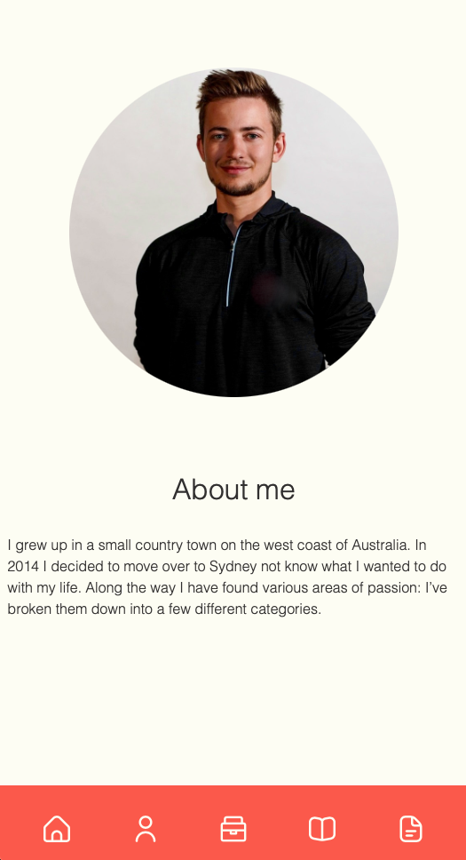
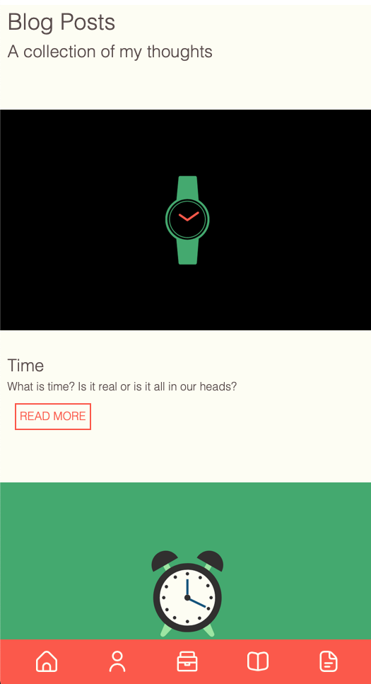
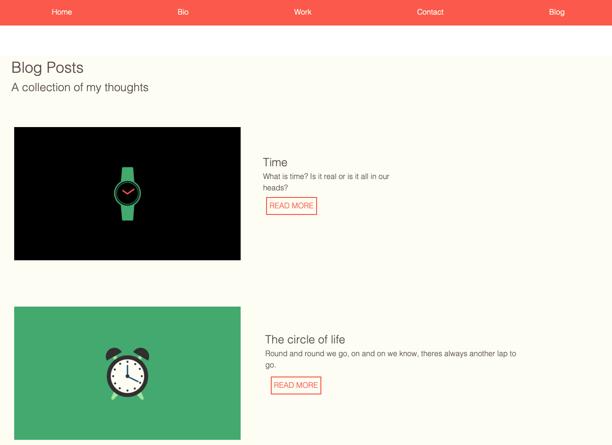

# T1A2 - LUKE HOOPER  
A link (URL) to your published portfolio website:
https://luke-hoopers-resume-website.netlify.app/_bio.html

A link to your GitHub repo:
https://github.com/Laaronhooper/resume_website

Description of your portfolio website including:
- Purpose:
  - The purpose of this repository is to cut my teeth on HTML and CSS. It is a portfolio project that is within my course at Coder Academy.

- Functionality / features:
  - The website was built from a mobile first design. With a sticky navigation panel at the bottom of the screen. Allowing ease of use for navigation between pages.
  - On larger screens navigation is near the top of the screen.
  - Features include fluid design through css variables, transforming elements and 

- Sitemap:
    - homepage 
      - bio page
      - blog page
        - blog posts 1-4
      - contact page
      - work experience page
    

- Screenshots:

- Target audience:
This website is aimed towards web developers and/or human resource representatives. With the goal to show my skills in the tech stack bellow and its application.

- Tech stack:
  - HTML
  - CSS
  - Netlify (Deployment)